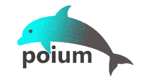

基于 selenium/appium 的 Page Objects 设计模式测试库。

* 极大的简化了Page层的元素定义。
* 同时支持selenium和appium
* 通过JavaScript扩展了selenium API
* 对原生 API 无损

## Installation

pip install:

```shell
> pip install poium
```

If you want to keep up with the latest version, you can install with github repository url:

```shell
> pip install -U git+https://github.com/SeldomQA/poium.git@master
```

## 旧版本说明

> `poium < 0.6.0`版本，主要提供了`Page`、`PageElement`、`PageElement`、`PageSelect`、`PageWait`等类。

[参考文档](./docs/base_old.md)

> `poium>=0.6.0, <1.0.0` 版本，新增了`NewPageElement`类，用新的方式重新实现了`PageElement`类的大部分功能。 推荐使用`NewPageElement` 类。

[参考文档](./docs/base_0.6.0.md)

## Sample

通过下面的例子，体会`Page Objects` 设计模式如此简单。

```python
from poium import Page, Element
from selenium import webdriver


class BaiduIndexPage(Page):
    search_input = Element(name='wd')
    search_button = Element(id_='su')


driver = webdriver.Chrome()
page = BaiduIndexPage(driver)
page.get("https://www.baidu.com")

page.search_input.send_keys("poium") 
page.search_button.click()

driver.quit()
```


更多例子，请点击[这里](/sample) 。

## Documentation

在开使用poium前，请快速阅读下面的文档。

* [Page和Element类](/docs/page_element.md)
* [Eelment类元素操作](docs/element_operation.md)
* [CSSElement类](/docs/csselement.md)
* [在Selenium中使用poium](docs/selenium_sample.md)
* [在appium中使用poium](docs/poium_sample.md)

## Project usage

* 在基于pytest的自动化项目中的应用，请点击[这里](https://github.com/defnngj/pyautoTest) 。

* 在基于seldom自动化测试框架的应用，请点击[这里](https://github.com/SeldomQA/seldom) 。

## Project History

参考项目：https://github.com/eeaston/page-objects

参考项目已经不再维护，我阅读了原项目代码，虽然只有100多行，但设计非常精妙。本项目在此基础上进行开发。

原项目名：https://pypi.org/project/selenium-page-objects/

本项目的核心是 Page Objects设计模式, 于是取了 __PO__，同时支持selenium/appium，于是取了 __ium__，那么新的项目命名为：__poium__。
