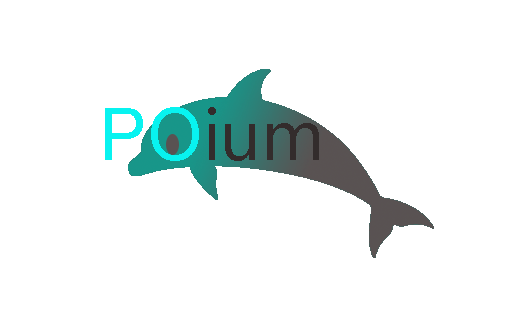

#### poium

基于 selenium/appium 的 Page Objects 设计模式测试库。

* 完全兼容原生selenium/appium API。
* 提供了一组基于JavaScript的API，实现部分selenium 不支持的操作。


#### Installation
------------

download install:

```shell
$ python setup.py install
```

pip install:
```
$ pip install poium
```

#### 简单例子：


支持selenium的例子。

```python
from poium import Page, PageElement
from selenium import webdriver


class BaiduIndexPage(Page):
    search_input = PageElement(css='#kw')
    search_button = PageElement(css='#su')


driver = webdriver.Chrome()

page = BaiduIndexPage(driver)
page.get("https://www.baidu.com")

page.search_input = "poium"
page.search_button.click()

driver.quit()
```

支持appium的例子。

```python
from poium import Page, PageElement
from appium import webdriver

class CalculatorPage(Page):
    number_1 = PageElement(id_="com.android.calculator2:id/digit_1")
    number_2 = PageElement(id_="com.android.calculator2:id/digit_2")
    add = PageElement(id_="com.android.calculator2:id/op_add")
    eq = PageElement(id_="com.android.calculator2:id/eq")

# APP定义运行环境
desired_caps = {
    'deviceName': 'Android Emulator',
    'automationName': 'appium',
    'platformName': 'Android',
    'platformVersion': '7.0',
    'appPackage': 'com.android.calculator2',
    'appActivity': '.Calculator',
}
driver = webdriver.Remote('http://localhost:4723/wd/hub', desired_caps)

page = CalculatorPage(driver)
page.number_1.click()
page.add.click()
page.number_2.click()
page.eq.click()

driver.quit()
```

使用poium将元素 __定位__ 与 __操作__ 分离，这将会非常有助于规模化自动化测试用例的编写与维护。

#### 使用文档：

请阅读 [wiki](https://github.com/defnngj/poium/wiki)

#### 项目历史：

参考项目：https://github.com/eeaston/page-objects

参考项目已经不再维护，我阅读了原项目代码，虽然只有100多行，但设计非常精妙。本项目在此基础上进行开发。

原项目名：https://pypi.org/project/selenium-page-objects/

有一天，我向群里的同学推荐selenium-page-objects，有同学问是否支持appium，appium也是从selenium继承而来，我想为什么不能支持appium呢？
于是，加入了appium支持，但是 selenium-page-objects 已经不能表达对appium的支持，而且他似乎有点长了。

本项目的核心是 Page Objects的设计模式, 于是取了 __PO__，同时支持selenium/appium，于是取了 __ium__，那么新的项目命名为：__poium__。
